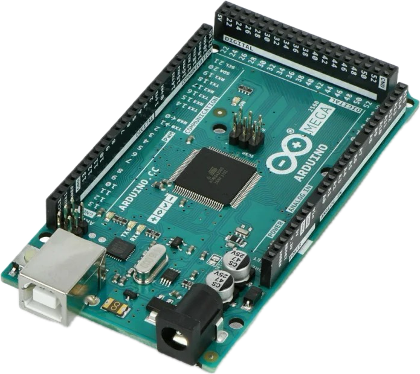
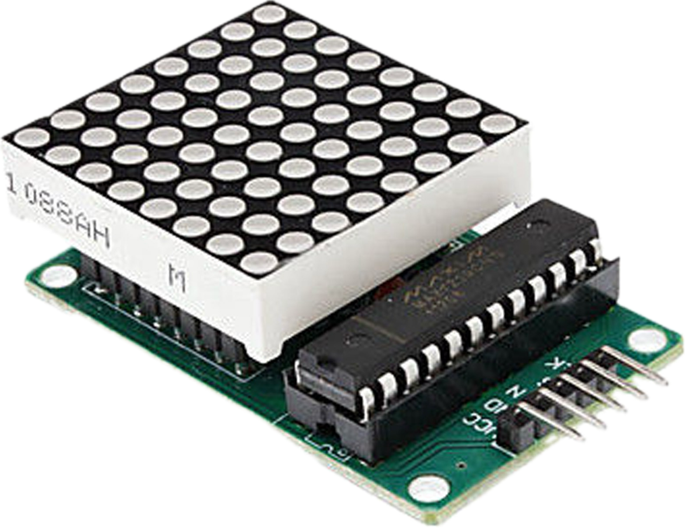
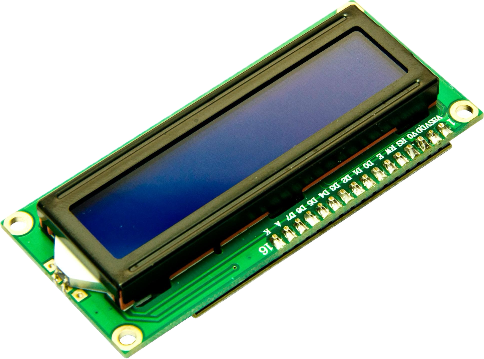
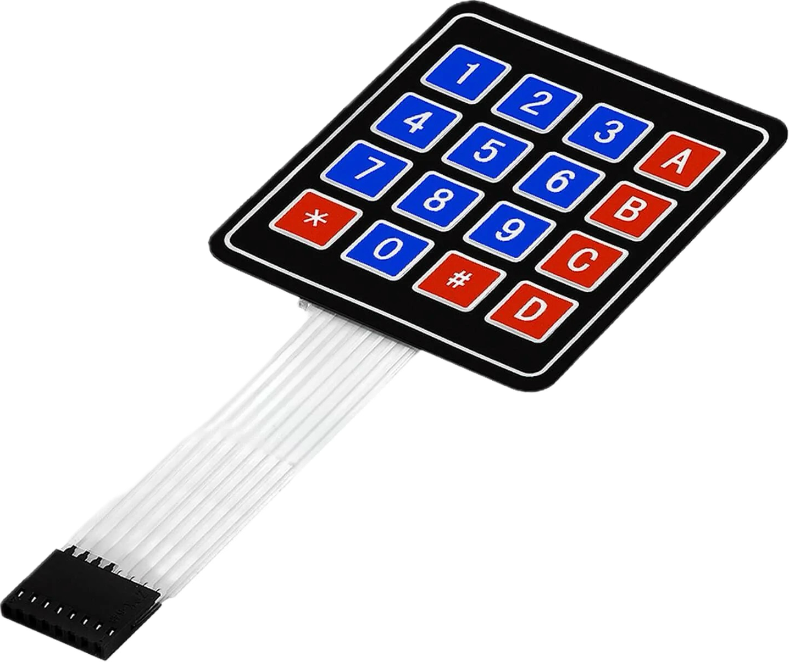

# Snake
a simple Snake game for Arduino 
I wrote the code as a final project in college

# Rules and game concept

- the game is over if the snake hits himself or a border 
- every time the snake eats an  apple the snake speeds a bit up and gain length
- its impossible to stier the snake backwards 
# Arduino board

| Description  | Img                                                                             |
| ------------ | ------------------------------------------------------------------------------- |
| Arduino Mega |  |
| Led Matrix   |              |
| LCD Display  |                    |
| KeyPad       |              |
| JoyStick     |              |
# How it work 

the Arduino mage board has an EEPROM Storage thats important to safe the Highscore.  
The LED matrix shows the snake and the apple, the apple flashes so you can see it better  
the keypad is an input device and was may first idea like in the classic snake game on the pc the 2,4,6,8 are the keys to control the snake direction  2 = upwards, 8 = downwards, 4 = left and, 6 = right.
but the joystick is way easier to handle in the code and for the game experience so i recommend to use the joystick.  
the lcd display just display some informations like the current snake length or the hight score.  
# The algorithm

The program constantly checks for user input and whether it is time for a new frame.
The game logic takes place in the frame. First of all it moves the snake based on the user input. then its checks for collisions with the border or himself. The program then checks whether the snake hit the field with the apple. after all check it apply the changes to the LED matrix it works like its removes all prints and print everything new.
